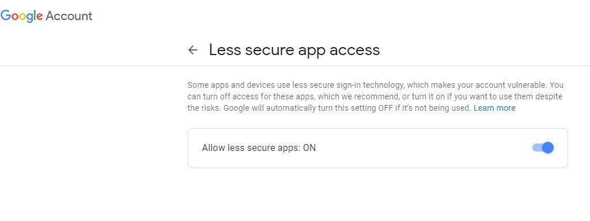
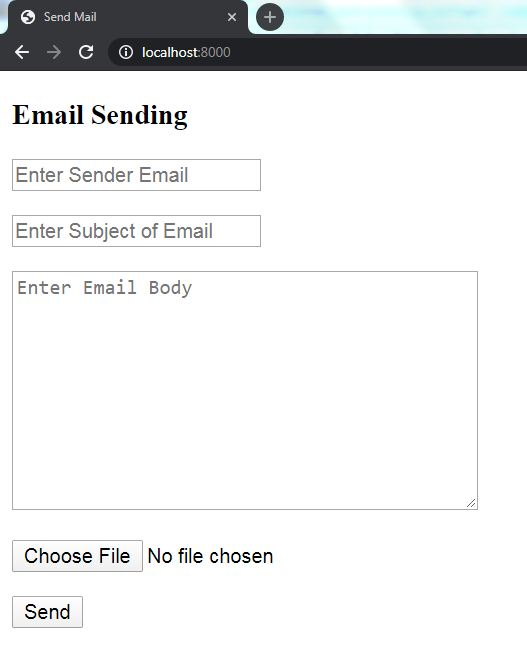

## Email Sending in Django

Python provides a mail sending interface using smtplib(Simple Mail Transfer Protocol) module, Django provides an inbuilt classes over it. These classes are provided to make sending email extra quick, to help test email sending during development. Follow the procedure given below to send an email.
____
### Enable Less Secure Apps Option in Google Account Settings

* Google Account Settings
    * Security
        * Turn on Less secure app access
        


Note : After completion of email sending turn off less secure apps option
____
### Add smtp and gmail account details in settings.py file existed in project folder
```python
EMAIL_USE_TLS = True  
EMAIL_HOST = 'smtp.gmail.com'  
EMAIL_PORT = 587  
EMAIL_HOST_USER = 'sender_username@gmail.com'
EMAIL_HOST_PASSWORD = '********'
```
____
### Create forms.py file in app folder for generating a form with subject, email, message, file fields by using below lines of code
```python
from django import forms  
class EmailForm(forms.Form):      
    email     = forms.EmailField(label = '', max_length = 40, 
    	        widget=forms.EmailInput(attrs={'placeholder':'Enter Sender Email'}))
    subject  = forms.CharField(label = '', max_length = 60, 
    	       widget=forms.TextInput(attrs={'placeholder':'Enter Subject of Email'}))
    body  = forms.CharField(label = '', max_length = 100, 
    	    widget = forms.Textarea(attrs = {'placeholder':'Enter Email Body'}))  
    file      = forms.FileField(label = '') # for creating file input
 
```
____
### In views.py from app folder create a view for sending an email as shown below

```python
from django.shortcuts import render
from django.http import HttpResponse
from email_sending.forms import EmailForm
from myProject import settings
from django.core.mail import EmailMessage

# Create your views here.

def sendMail(request):
	if request.method == 'POST':
		to_mail = request.POST['email']
		from_mail = settings.EMAIL_HOST_USER
		email_sub = request.POST['subject']
		email_body = request.POST['body']
		file_name = request.POST['file']
		mail = EmailMessage(email_sub, email_body, from_mail, [to_mail])
		mail.attach_file(settings.STATIC_ROOT+settings.MEDIA_URL+file_name)
		mail.send()
		return HttpResponse("<h3 style = 'color:green'>Email sent successfully..!!!</h3>")
	email_form = EmailForm()
	return render(request, 'email.html', {'form' : email_form})
```

* In this case myProject is projectname and email_sending is appname
	* Imported settings from myProject to access host email address and static file path
	* Imported EmailForm from forms.py in email_sending app
* EmailMessage is the classname in django.core.mail used for sending an email this class needs subject of email, body of email, sender mail, receiver mail parameters
	* attch_file() is function of EmailMessage class to send an attacment along with email, It requires file path
____
### Create email.html file in templates folder existed in app folder with below lines of html code
```html
<!DOCTYPE html>
<html>
<head>
	<title>Send Mail</title>
</head>
<body>
<h3>Email Sending</h3>
<form action="" method="POST">
	
	{{ form.as_p }}
	<button type="submit">Send</button>  
</form>
</body>
</html>
```
____
### Now include sendMail view in urls.py existed in project folder
```python
from django.contrib import admin
from django.urls import path
from email_sending import views

urlpatterns = [
    path('admin/', admin.site.urls),
    path('', views.sendMail, name = 'send_mail')
]
```
____
### Run the server and check in browser will get an form for entering details to send an email as shown below


____


